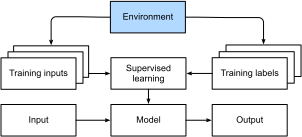

# Введение
:label:`chap_introduction`

До недавних пор почти каждая компьютерная программа, с которой вы обычно взаимодействовали, была написана в виде жесткого набора правил, точно определяющих ее поведение. Допустим, мы хотели написать приложение для управления платформой электронной коммерции. Проведя несколько часов у доски и обдумав проблему, мы могли бы остановиться на общих чертах рабочего решения, например: (i) пользователи взаимодействуют с приложением через интерфейс запущенный в веб-браузере или мобильном приложении; (ii) наше приложение взаимодействует с ядром базы данных коммерческого уровня, чтобы отслеживать состояние каждого пользователя и вести записи транзакций; и (iii) в основе нашего приложения лежит *бизнес-логика* (можно сказать, *мозг*) в виде методично изложенного набора правил, которые сопоставляют все мыслимые обстоятельства с соответствующими действиями, которые должна выполнять наша программа.

Для построения мозга нашего приложения, мы должны были перечислить все возможные события, которые должна обрабатывать наша программа. Например, всякий раз, когда покупатель кликает, чтобы добавить товар в свою корзину, наша программа должна добавить запись в таблицу базы данных корзины покупок, связав идентификатор этого пользователя с идентификатором добавляемого продукта. Затем нам надо попытаться проверить всевозможные крайние случаи на соответствие правилам и внести необходимые изменения. Что произойдет, если пользователь совершит покупку с пустой корзиной? Хотя немногие разработчики пишут полностью верный код с первого раза (может потребоваться несколько тестовых прогонов, чтобы проработать баги), по большему счету мы можем писать такие программы и уверенно запускать их *прежде*, чем увидим реального клиента. Наша способность вручную разрабатывать автоматизированные системы, которые управляют функционирующими продуктами и системами, часто в новых ситуациях, является замечательным когнитивным достижением. А когда вы можете разрабатывать решения, которые работают $100\%$ времени, вам обычно не следует беспокоиться о машинном обучении. 

К счастью для растущего сообщества специалистов занимающихся машинным обучением, многие задачи, которые мы хотим автоматизировать, не так легко подчиняются человеку. Представьте, что вы у доски с самыми лучшими умами, но на этот раз вы решаете одну из следующих проблем:

* Написать программу, предсказывающую погоду на завтра с учетом географической информации, спутниковых изображений и информации о погоде в прошлом.
* Напишисать программу, которая принимает на вход вопросы, выраженные в произвольной форме, и дает правильные ответы.
* Напишисать программу, которая  идентифицирует всех людей на изображении, и обводит их контурами.
* Напишисать программу, которая знакомит пользователей с продуктами, которые им понравятся, но с которыми они вряд ли столкнутся просматривая каталог.

Решить такие задачи с нуля будет нелегко даже лучшим программистам. Причины могут быть разными. Иногда алгоритм который мы ищем, следует паттерну меняющемуся со временем, поэтому нет неизменного правильного ответа! В таких случаях любое успешное решение должно адаптироваться к меняющемуся миру. В других случаях взаимосвязь (например, между пикселями и абстрактными категориями) может быть слишком сложной, требуя тысяч или миллионов вычислений и следуя неизвестным принципам. Как и при распознавании изображений, шаги по выполнению задачи часто выходят за рамки нашего сознательного понимания, даже когда наши подсознательные когнитивные процессы могут легко выполнить задачу.

*Машинное обучение* - это изучение алгоритмов, которые могут учиться на собственном опыте. По мере того как алгоритм машинного обучения накапливает больше опыта, обычно в виде результатов наблюдений или взаимодействий с окружающей средой, его производительность улучшается. Сравните это с нашей детерминированной платформой электронной коммерции, которая следует одной и той же бизнес-логике, независимо от накопленного опыта, пока сами разработчики не разберутся и решат, что пора обновить программное обеспечение. В этой книге мы научим вас основам машинного обучения, уделяя особое внимание *глубокому обучению* - мощному набору методов, двигающему инновации в таких различных областях, как компьютерное зрение, обработка естественного языка, здравоохранение и геномика.

## Мотивирующий пример

Перед тем, как начать писать, авторы этой книги решили взбодрить себя кофеином. Мы сели в машину и поехали. Используя iPhone, Алекс сказал «Привет, Сири, активировав систему распознавания голоса в телефоне. Затем Му скомандовал: «Как добраться до кофейни Blue Bottle». Телефон быстро отобразил транскрипцию его команды. Он также ионял, что мы спрашивали дорогу, и запустил приложение "Карты", чтобы выполнить наш запрос. После запуска приложение определило несколько маршрутов. Рядом с каждым маршрутом телефон отображал прогнозируемое время в пути. Мы придумали эту историю для учебных целей, но она демонстрирует, что всего за несколько секунд нашего повседневного взаимодействия со смартфоном может задействоваться несколько моделей машинного обучения.

Представьте, что вы пишете программу, которая реагирует на *слово пробуждения*, такое как «Алекса», «Окей, Google» или «Привет, Siri». Попробуйте сделать это самостоятельно, используя только компьютер и редактор кода, как показано в: numref: `fig_wake_word`. С чего бы вы начали? Подумайте об этом ... проблема сложная. Каждую секунду микрофон собирает примерно 44000 сэмплов. Каждый сэмпл представляет собой измерение амплитуды звуковой волны. Какое правило могло бы надежно сопоставить фрагмент необработанного звука с достоверным предсказанием $\{\text{да}, \text{нет}\}$ о том, содержит ли этот фрагмент слово пробуждения? Если вы застряли, не волнуйтесь. Мы тоже не знаем как написать такую программу с нуля. Вот почему мы используем машинное обучение.


:label:`fig_wake_word`

Вот вам уловка. Часто, даже если мы не знаем, как написать программу отображающую входные данные в выходные, мы все же способны выполнять когнитивную задачу сами. Другими словами, даже если вы не знаете, как запрограммировать компьютер на распознавание слова «Алекса», вы сами можете его распознать. Вооружившись этой способностью, мы можем собрать огромный *набор данных*, содержащий примеры аудио, и поделить их на содержащие и не содержащие нужное нам слово. При использовании машинного обучения мы не пытаемся *явно* создать систему распознающую слово пробуждения. Вместо этого мы определяем гибкую программу, поведение которой зависит от набора *параметров*. Затем мы используем наши данные для получения наилучшего возможного набора параметров, которые улучшают работу нашей программы относительно некоторой заданной в задаче метрике качества.

Вы можете думать об этих параметрах как о ручках, которые мы можем крутить, управляя поведением программы. Программу с фиксированными параметрами мы называем *модель*. Набор всех конкретных программ (сопоставлений ввода-вывода), которые мы можем создать, управляя параметрами, называется *семейством* моделей. А метапрограмма, использующая наш набор данных для выбора параметров, называется *алгоритмом обучения*.

Прежде чем мы сможем задействовать алгоритм обучения, нам нужно определить проблему, определить точную природу входных и выходных данных и выбрать подходящее семейство моделей. В этом случае наша модель получает фрагмент звука как *входные данные*, а модель возвращает выбор из $\{\text{да}, \text{нет}\}$ в качестве *результата*. Если все пройдет по плану, модели будет, как правило, верно угадывать наличие в фрагменте пробуждающего слова.

Если мы возьмем верное семейство моделей, должна существовать такая настройка ручек, чтобы модель срабатывала положительно каждый раз, когда слышит слово «Алекса». Поскольку выбор слова для пробуждения является произвольным, нам, вероятно, понадобится достаточно богатое семейство моделей, срабатывающее на других настроек параметров при прослушивании слова «Абрикос». Мы ожидаем, что одно и то же семейство моделей должно подходить для распознавания «Алекса» и «Абрикос», потому что интуитивно задачи кажутся похожими. Однако нам может потребоваться совершенно другое семейство моделей, если мы хотим иметь дело с принципиально другими входами или выходами, скажем, если мы хотим преобразовать изображения в тексты или английские предложения в китайские.

Можно догадаться, что если мы просто установим все ручки случайным образом, маловероятно, что наша модель распознает «Алекса», «Абрикос» или любое другое  слово. В машинном обучении *обучение* - это процесс с помощью которого мы находим правильную настройку параметров, приводящую к желаемому поведению нашей модели. Другими словами, мы *обучаем* нашу модель на данных. Как показано в: numref: `fig_ml_loop`, процесс обучения обычно выглядит следующим образом:

1. Начните с модели со случайными настройками, которая не может сделать ничего полезного.
2. Возьмите некоторые из ваших данных (например, аудиофрагменты и соответствующие им ответы $\{\text{да}, \text{нет}\}$).
3. Отрегулируйте ручки так, чтобы модель реже ошибалась на этих данных.
4. Повторяйте шаги 2 и 3, пока модель не станет отличной.


:label:`fig_ml_loop`

Подводя итог, вместо того, чтобы программировать распознаватель слов пробуждения, мы создаем программу, которая может *научиться* распознавать слова пробуждения, если мы дадим ей большой размеченный набор данных. Определение поведения программы с помощью набора данных мы называем *программированием с данными*. Например, мы можем «запрограммировать» детектор кошек, снабдив нашу систему машинного обучения множеством примеров кошек и собак. Детектор в конечном итоге научится возвращать очень большое положительное число, если это кошка, очень большое отрицательное число, если это собака, и что-то близкое к нулю, если он не уверен. И это едва ли не самая малость из того, что может машинное обучение. Глубокое обучение, которое мы объясним более подробно позже, является лишь одним из многих популярных методов решения проблем машинного обучения.

## Ключевые компоненты

В нашем примере с пробуждающим словом мы описали набор данных, состоящий из звуковых фрагментов и бинарных меток и дали некоторую интуицию о том, как можно обучить модель приближению отображения фрагментов звука в классификацию. Задача такого рода, решая которую мы пытаемся предсказать  неизвестную метку на основе входных данных состоящих из примеров, для которых метки известны, называется *обучением с учителем*. Это лишь одна из многих задач машинного обучения. Позже мы подробно рассмотрим различные типы задач машинного обучения. Вначале, мы хотели бы пролить больше света на некоторые основные компоненты, с которыми мы будем сталкиваться независимо от того, за какую задачу машинного обучения мы возьмемся:

1. *Данные* на которых мы обучимся.
2. *Модель* того, как мы преобразуем данные.
3. *Целевая функция*, которая количественно определяет, насколько хорошо (или плохо) работает модель.
4. *Алгоритм* настройки параметров модели для оптимизации целевой функции.

### Данные

Очевидно, что вы не сможете заниматься наукой о данных без данных. Мы могли бы потратить сотни страниц, размышляя о том, что именно представляют собой данные, но сейчас мы остановимся на практической стороне и сосредоточимся на ключевых свойствах, достойных внимания. В общем, нам  интересен набор примеров. Чтобы получать пользу от работы с данными с пользой, нам обычно требуется их подходящее числовое представление. Каждый *пример* (или *точка данных*, *экземпляр данных*, *образец*) обычно состоит из набора атрибутов, называемых *признаками* (или *ковариатами*), на основе которых модель должна делать свои прогнозы. В приведенных выше задачах контролируемого обучения нужно предсказать специальный атрибут, обозначенный как *метка* (или *целевое значение*). 

В случае с изображениями, каждая отдельная фотография может представлять собой экземпляр данных представленный упорядоченным списком числовых значений, соответствующих яркости каждого пикселя. Цветная фотография $200\times 200$ будет состоять из $200\times 200\times 3 = 120000$ числовых значений, соответствующих яркости красного, зеленого и синего каналов для каждой точки изображения. В другой традиционной задаче мы можем попробовать предсказать, выживет или нет пациент, учитывая стандартный набор характеристик, таких как возраст, жизненно важные показатели и диагнозы.

Когда каждый элемент характеризуется одинаковым количеством числовых значений, мы говорим, что данные состоят из векторов фиксированной длины, и называем эту величину как *размерность* данных. Очевидно, фиксированная длина является удобным свойством. Если мы хотим обучить модель распознавать рак на  изображениях микроскопа, входные данные фиксированной длины означают, что у нас на одну проблему меньше.

Однако не все данные можно просто представить как векторы *фиксированной длины*. Мы можем ожидать, что изображения с микроскопов будут поступать со стандартного оборудования, но не стоит ждать, что  изображения, полученные из Интернета, будут иметь одинаковое разрешение или форму. Что касается изображений, мы можем подумать об их обрезке до стандартного размера, но эта стратегия подходит нам частично. Мы рискуем потерять информацию в обрезанных частях. Текстовые данные еще сильнее сопротивляются представлению в виде вектора фиксированной длины. Посмотрите на отзывы клиентов, оставленных на сайтах электронной коммерции, таких как Amazon, IMDB и TripAdvisor. Некоторые из них короткие: «Воняет!». Остальные занимают по нескольку страниц. Одним из основных преимуществ глубокого обучения перед традиционными методами является сравнительное изящество, с которым современные модели могут обрабатывать данные *переменной длины*.

Как правило, чем больше у нас данных, тем легче становится наша работа. Когда у нас будет данных, мы можем обучать более мощные модели и меньше полагаться на заранее  заданные предположения. Переход со (сравнительно) небольших данных на большие стал основным вкладом в успех современного глубокого обучения. Подводя итог, можно сказать, что многие из наиболее интересных моделей глубокого обучения не работают без больших наборов данных. Некоторые могут работать и в режиме малых данных, но они как правило не улучшают традиционные подходы.

Наконец, недостаточно просто иметь много данных и грамотно их обрабатывать. Нам нужны *правильные* данные. Если данные полны ошибок, или если отобранные признаки не позволяют прогнозировать интересующее нас целевое значение, обучение будет неудачным. Ситуацию хорошо передает клише: *мусор на входе, мусор на выходе*. Более того, плохое качество прогноза - не единственное возможное последствие. В чувствительных приложениях машинного обучения, таких как прогнозирование для полиции, скриннинг резюме или модели рисков используемых для кредитования, мы должны быть особенно внимательны к возможным последствиям от мусора в данных. Один частый провал в работе моделей возникает из за того, что некоторые группы людей не представлены в обучающей выборке. Представьте себе применение системы распознавания рака кожи, которая никогда раньше не видела черной кожи. Ошибка также может произойти, в случае когда данные не просто недостаточно представляют некоторые группы людей, но и отражают общественные предрассудки. Например, если прошлые решения о приеме на работу используются для обучения модели прогнозирования, которая будет использоваться для просмотра резюме, то модели машинного обучения могут непреднамеренно вобрать в себя и автоматизировать историческую несправедливость. Обратите внимание, что все это может произойти без специального умысла или даже без ведома специалиста по данным.

### Модели

Most machine learning involves transforming the data in some sense.
We might want to build a system that ingests photos and predicts smiley-ness.
Alternatively,
we might want to ingest a set of sensor readings
and predict how normal vs. anomalous the readings are.
By *model*, we denote the computational machinery for ingesting data
of one type, 
and spitting out predictions of a possibly different type.
In particular, we are interested in statistical models
that can be estimated from data.
While simple models are perfectly capable of addressing
appropriately simple problems,
the problems
that we focus on in this book stretch the limits of classical methods.
Deep learning is differentiated from classical approaches
principally by the set of powerful models that it focuses on.
These models consist of many successive transformations of the data
that are chained together top to bottom, thus the name *deep learning*.
On our way to discussing deep models,
we will also discuss some more traditional methods.

### Objective Functions

Earlier, we introduced machine learning as learning from experience.
By *learning* here,
we mean improving at some task over time.
But who is to say what constitutes an improvement?
You might imagine that we could propose to update our model,
and some people might disagree on whether the proposed update
constituted an improvement or a decline.

In order to develop a formal mathematical system of learning machines,
we need to have formal measures of how good (or bad) our models are.
In machine learning, and optimization more generally,
we call these *objective functions*.
By convention, we usually define objective functions
so that lower is better.
This is merely a convention. 
You can take any function
for which higher is better, and turn it into a new function
that is qualitatively identical but for which lower is better
by flipping the sign.
Because lower is better, these functions are sometimes called
*loss functions*.

When trying to predict numerical values,
the most common loss function is *squared error*,
i.e., the square of the difference between the prediction and the ground-truth.
For classification, the most common objective is to minimize error rate,
i.e., the fraction of examples on which
our predictions disagree with the ground truth.
Some objectives (e.g., squared error) are easy to optimize.
Others (e.g., error rate) are difficult to optimize directly,
owing to non-differentiability or other complications.
In these cases, it is common to optimize a *surrogate objective*.

Typically, the loss function is defined
with respect to the model's parameters
and depends upon the dataset.
We learn
the best values of our model's parameters
by minimizing the loss incurred on a set
consisting of some number of examples collected for training.
However, doing well on the training data
does not guarantee that we will do well on unseen data.
So we will typically want to split the available data into two partitions:
the *training dataset* (or *training set*, for fitting model parameters)
and the *test dataset* (or *test set*, which is held out for evaluation),
reporting how the model performs on both of them.
You could think of training performance as being like
a student's scores on practice exams
used to prepare for some real final exam.
Even if the results are encouraging,
that does not guarantee success on the final exam.
In other words,
the test performance can deviate significantly from the training performance. 
When a model performs well on the training set
but fails to generalize to unseen data,
we say that it is *overfitting*.
In real-life terms, this is like flunking the real exam
despite doing well on practice exams.


### Optimization Algorithms

Once we have got some data source and representation,
a model, and a well-defined objective function,
we need an algorithm capable of searching
for the best possible parameters for minimizing the loss function.
Popular optimization algorithms for deep learning
are based on an approach called *gradient descent*.
In short, at each step, this method 
checks to see, for each parameter,
which way the training set loss would move
if you perturbed that parameter just a small amount.
It then updates
the parameter in the direction that may reduce the loss.

## Kinds of Machine Learning Problems

The wake word problem in our motivating example
is just one among
many problems that machine learning can tackle.
To motivate the reader further
and provide us with some common language when we talk about more problems throughout the book,
in the following we 
list a sampling of machine learning problems.
We will constantly refer to
our aforementioned concepts 
such as data, models, and training techniques.

### Supervised Learning

Supervised learning addresses the task of
predicting labels given input features.
Each feature--label pair is called an example.
Sometimes, when the context is clear, we may use the term *examples*
to refer to a collection of inputs,
even when the corresponding labels are unknown.
Our goal is to produce a model
that maps any input to a label prediction.


To ground this description in a concrete example,
if we were working in healthcare,
then we might want to predict whether or not
a patient would have a heart attack.
This observation, "heart attack" or "no heart attack",
would be our label.
The input features might be vital signs
such as heart rate, diastolic blood pressure, 
and systolic blood pressure.

The supervision comes into play because for choosing the parameters, we (the supervisors) provide the model with a dataset
consisting of labeled examples,
where each example is matched with the ground-truth label.
In probabilistic terms, we typically are interested in estimating
the conditional probability of a label given input features.
While it is just one among several paradigms within machine learning,
supervised learning accounts for the majority of successful
applications of machine learning in industry.
Partly, that is because many important tasks
can be described crisply as estimating the probability
of something unknown given a particular set of available data:

* Predict cancer vs. not cancer, given a computer tomography image.
* Predict the correct translation in French, given a sentence in English.
* Predict the price of a stock next month based on this month's financial reporting data.

Even with the simple description
"predicting labels given input features"
supervised learning can take a great many forms
and require a great many modeling decisions,
depending on (among other considerations) the type, size,
and the number of inputs and outputs.
For example, we use different models to process sequences of arbitrary lengths
and for processing fixed-length vector representations.
We will visit many of these problems in depth
throughout this book.

Informally, the learning process looks something like the following.
First, grab a big collection of examples for which the features are known
and select from them a random subset,
acquiring the ground-truth labels for each.
Sometimes these labels might be available data that have already been collected
(e.g., did a patient die within the following year?)
and other times we might need to employ human annotators to label the data,
(e.g., assigning images to categories).
Together, these inputs and corresponding labels comprise the training set.
We feed the training dataset into a supervised learning algorithm,
a function that takes as input a dataset
and outputs another function: the learned model.
Finally, we can feed previously unseen inputs to the learned model,
using its outputs as predictions of the corresponding label.
The full process is drawn in :numref:`fig_supervised_learning`.


:label:`fig_supervised_learning`

#### Regression

Perhaps the simplest supervised learning task
to wrap your head around is *regression*.
Consider, for example, a set of data harvested
from a database of home sales.
We might construct a table, 
where each row corresponds to a different house,
and each column corresponds to some relevant attribute,
such as the square footage of a house, 
the number of bedrooms, the number of bathrooms, and the number of minutes (walking) to the center of town.
In this dataset, each example would be a specific house,
and the corresponding feature vector would be one row in the table.
If you live in New York or San Francisco,
and you are not the CEO of Amazon, Google, Microsoft, or Facebook,
the (sq. footage, no. of bedrooms, no. of bathrooms, walking distance)
feature vector for your home might look something like: $[600, 1, 1, 60]$.
However, if you live in Pittsburgh, it might look more like $[3000, 4, 3, 10]$.
Feature vectors like this are essential
for most classic machine learning algorithms.

What makes a problem a regression is actually the output.
Say that you are in the market for a new home.
You might want to estimate the fair market value of a house,
given some features like above.
The label, the price of sale, is a numerical value.
When labels take on arbitrary numerical values,
we call this a *regression* problem.
Our goal is to produce a model whose predictions
closely approximate the actual label values.


Lots of practical problems are well-described regression problems.
Predicting the rating that a user will assign to a movie
can be thought of as a regression problem
and if you designed a great algorithm to accomplish this feat in 2009,
you might have won the [1-million-dollar Netflix prize](https://en.wikipedia.org/wiki/Netflix_Prize).
Predicting the length of stay for patients in the hospital
is also a regression problem.
A good rule of thumb is that any *how much?* or *how many?* problem
should suggest regression,
such as:

* How many hours will this surgery take?
* How much rainfall will this town have in the next six hours?


Even if you have never worked with machine learning before,
you have probably worked through a regression problem informally.
Imagine, for example, that you had your drains repaired
and that your contractor spent 3 hours
removing gunk from your sewage pipes.
Then he sent you a bill of 350 dollars.
Now imagine that your friend hired the same contractor for 2 hours
and that he received a bill of 250 dollars.
If someone then asked you how much to expect
on their upcoming gunk-removal invoice
you might make some reasonable assumptions,
such as more hours worked costs more dollars.
You might also assume that there is some base charge
and that the contractor then charges per hour.
If these assumptions held true, then given these two data examples,
you could already identify the contractor's pricing structure:
100 dollars per hour plus 50 dollars to show up at your house.
If you followed that much then you already understand
the high-level idea behind linear regression.

In this case, we could produce the parameters
that exactly matched the contractor's prices.
Sometimes this is not possible, 
e.g., if some of
the variance owes to a few factors 
besides your two features.
In these cases, we will try to learn models
that minimize the distance between our predictions and the observed values.
In most of our chapters, we will focus on 
minimizing the squared error loss function.
As we will see later, this loss corresponds to the assumption
that our data were corrupted by Gaussian noise.

#### Classification

While regression models are great for addressing *how many?* questions,
lots of problems do not bend comfortably to this template.
For example,
a bank wants to add check scanning to its mobile app.
This would involve the customer snapping a photo of a check
with their smart phone's camera
and the app would need to be able
to automatically understand text seen in the image.
Specifically,
it would also need to understand handwritten text to be even more robust,
such as mapping a handwritten character
to one of the known characters.
This kind of *which one?* problem is called *classification*.
It is treated with a different set of algorithms
than those used for regression although many techniques will carry over.

In *classification*, we want our model to look at features,
e.g., the pixel values in an image,
and then predict which *category* (formally called *class*),
among some discrete set of options, an example belongs.
For handwritten digits, we might have ten classes,
corresponding to the digits 0 through 9.
The simplest form of classification is when there are only two classes,
a problem which we call *binary classification*.
For example, our dataset could consist of images of animals
and our labels  might be the classes $\mathrm{\{cat, dog\}}$.
While in regression, we sought a regressor to output a numerical value,
in classification, we seek a classifier, whose output is the predicted class assignment.

For reasons that we will get into as the book gets more technical,
it can be hard to optimize a model that can only output
a hard categorical assignment, 
e.g., either "cat" or "dog".
In these cases, it is usually much easier to instead express
our model in the language of probabilities.
Given features of an example, 
our model assigns a probability
to each possible class. 
Returning to our animal classification example
where the classes are $\mathrm{\{cat, dog\}}$,
a classifier might see an image and output the probability
that the image is a cat as 0.9.
We can interpret this number by saying that the classifier
is 90\% sure that the image depicts a cat.
The magnitude of the probability for the predicted class
conveys one notion of uncertainty.
It is not the only notion of uncertainty
and we will discuss others in more advanced chapters.

When we have more than two possible classes,
we call the problem *multiclass classification*.
Common examples include hand-written character recognition
$\mathrm{\{0, 1, 2, ... 9, a, b, c, ...\}}$.
While we attacked regression problems by trying
to minimize the squared error loss function,
the common loss function for classification problems is called *cross-entropy*,
whose name can be demystified 
via an introduction to information theory in subsequent chapters.

Note that the most likely class is not necessarily
the one that you are going to use for your decision.
Assume that you find a beautiful mushroom in your backyard
as shown in :numref:`fig_death_cap`.


:width:`200px`
:label:`fig_death_cap`

Now, assume that you built a classifier and trained it
to predict if a mushroom is poisonous based on a photograph.
Say our poison-detection classifier outputs
that the probability that
:numref:`fig_death_cap` contains a death cap is 0.2.
In other words, the classifier is 80\% sure
that our mushroom is not a death cap.
Still, you would have to be a fool to eat it.
That is because the certain benefit of a delicious dinner
is not worth a 20\% risk of dying from it.
In other words, the effect of the uncertain risk
outweighs the benefit by far.
Thus, we need to compute the expected risk that we incur as the loss function,
i.e., we need to multiply the probability of the outcome
with the benefit (or harm) associated with it.
In this case,
the loss incurred by eating the mushroom
can be $0.2 \times \infty + 0.8 \times 0 = \infty$,
whereas the loss of discarding it is
$0.2 \times 0 + 0.8 \times 1 = 0.8$.
Our caution was justified:
as any mycologist would tell us,
the mushroom in :numref:`fig_death_cap` actually
is a death cap.

Classification can get much more complicated than just
binary, multiclass, or even multi-label classification.
For instance, there are some variants of classification
for addressing hierarchies.
Hierarchies assume that there exist some relationships among the many classes.
So not all errors are equal---if we must err, we would prefer
to misclassify to a related class rather than to a distant class.
Usually, this is referred to as *hierarchical classification*.
One early example is due to [Linnaeus](https://en.wikipedia.org/wiki/Carl_Linnaeus), who organized the animals in a hierarchy.

In the case of animal classification,
it might not be so bad to mistake a poodle (a dog breed) for a schnauzer (another dog breed),
but our model would pay a huge penalty
if it confused a poodle for a dinosaur.
Which hierarchy is relevant might depend
on how you plan to use the model.
For example, rattle snakes and garter snakes
might be close on the phylogenetic tree,
but mistaking a rattler for a garter could be deadly.

#### Tagging

Some classification problems fit neatly
into the binary or multiclass classification setups.
For example, we could train a normal binary classifier
to distinguish cats from dogs.
Given the current state of computer vision,
we can do this easily, with off-the-shelf tools.
Nonetheless, no matter how accurate our model gets,
we might find ourselves in trouble when the classifier
encounters an image of the *Town Musicians of Bremen*,
a popular German fairy tale featuring four animals
in :numref:`fig_stackedanimals`.


:width:`300px`
:label:`fig_stackedanimals`

As you can see, there is a cat in :numref:`fig_stackedanimals`,
and a rooster, a dog, and a donkey,
with some trees in the background.
Depending on what we want to do with our model
ultimately, treating this as a binary classification problem
might not make a lot of sense.
Instead, we might want to give the model the option of
saying the image depicts a cat, a dog, a donkey,
*and* a rooster.

The problem of learning to predict classes that are
not mutually exclusive is called *multi-label classification*.
Auto-tagging problems are typically best described
as multi-label classification problems.
Think of the tags people might apply to posts on a technical blog,
e.g., "machine learning", "technology", "gadgets",
"programming languages", "Linux", "cloud computing", "AWS".
A typical article might have 5--10 tags applied
because these concepts are correlated.
Posts about "cloud computing" are likely to mention "AWS"
and posts about "machine learning" could also deal
with "programming languages".

We also have to deal with this kind of problem when dealing
with the biomedical literature, where correctly tagging articles is important
because it allows researchers to do exhaustive reviews of the literature.
At the National Library of Medicine, a number of professional annotators
go over each article that gets indexed in PubMed
to associate it with the relevant terms from MeSH,
a collection of roughly 28000 tags.
This is a time-consuming process and the
annotators typically have a one-year lag between archiving and tagging.
Machine learning can be used here to provide provisional tags
until each article can have a proper manual review.
Indeed, for several years, the BioASQ organization
has [hosted competitions](http://bioasq.org/) to do precisely this.

#### Search 

Sometimes we do not just want to assign each example to a bucket
or to a real value. In the field of information retrieval,
we want to impose a ranking on a set of items.
Take web search for an example. 
The goal is less to determine whether
a particular page is relevant for a query, but rather,
which one of the plethora of search results is
most relevant
for a particular user.
We really care about the ordering of the relevant search results
and our learning algorithm needs to produce ordered subsets
of elements from a larger set.
In other words, if we are asked to produce the first 5 letters from the alphabet, there is a difference
between returning "A B C D E" and "C A B E D".
Even if the result set is the same,
the ordering within the set matters.

One possible solution to this problem is to first assign
to every element in the set a corresponding relevance score
and then to retrieve the top-rated elements.
[PageRank](https://en.wikipedia.org/wiki/PageRank),
the original secret sauce behind the Google search engine
was an early example of such a scoring system but it was
peculiar in that it did not depend on the actual query.
Here they relied on a simple relevance filter
to identify the set of relevant items
and then on PageRank to order those results
that contained the query term.
Nowadays, search engines use machine learning and behavioral models
to obtain query-dependent relevance scores.
There are entire academic conferences devoted to this subject.

#### Recommender Systems
:label:`subsec_recommender_systems`

Recommender systems are another problem setting
that is related to search and ranking.
The problems are similar insofar as the goal
is to display a set of relevant items to the user.
The main difference is the emphasis on
*personalization*
to specific users in the context of recommender systems.
For instance, for movie recommendations,
the results page for a science fiction fan
and the results page
for a connoisseur of Peter Sellers comedies might differ significantly.
Similar problems pop up in other recommendation settings,
e.g., for retail products, music, and news recommendation.

In some cases, customers provide explicit feedback communicating
how much they liked a particular product
(e.g., the product ratings and reviews on Amazon, IMDb, and Goodreads).
In some other cases, they provide implicit feedback,
e.g., by skipping titles on a playlist,
which might indicate dissatisfaction but might just indicate
that the song was inappropriate in context.
In the simplest formulations, these systems are trained
to estimate some score,
such as an estimated rating
or the probability of purchase,
given a user and an item.

Given such a model, 
for any given user,
we could retrieve the set of objects with the largest scores,
which could then be recommended to the user.
Production systems are considerably more advanced and take
detailed user activity and item characteristics into account
when computing such scores. :numref:`fig_deeplearning_amazon` is an example
of deep learning books recommended by Amazon based on personalization algorithms tuned to capture one's preferences.


:label:`fig_deeplearning_amazon`

Despite their tremendous economic value,
recommendation systems
naively built on top of predictive models
suffer some serious conceptual flaws.
To start, we only observe *censored feedback*:
users preferentially rate movies that they feel strongly about.
For example, 
on a five-point scale,
you might notice that items receive many five and one star ratings
but that there are conspicuously few three-star ratings.
Moreover, current purchase habits are often a result
of the recommendation algorithm currently in place,
but learning algorithms do not always take this detail into account.
Thus it is possible for feedback loops to form
where a recommender system preferentially pushes an item
that is then taken to be better (due to greater purchases)
and in turn is recommended even more frequently.
Many of these problems about how to deal with censoring,
incentives, and feedback loops, are important open research questions.

#### Sequence Learning

So far, we have looked at problems where we have
some fixed number of inputs and produce a fixed number of outputs.
For example,
we considered predicting house prices from a fixed set of features: square footage, number of bedrooms,
number of bathrooms, walking time to downtown.
We also discussed mapping from an image (of fixed dimension)
to the predicted probabilities that it belongs to each
of a fixed number of classes, or taking a user ID and a product ID,
and predicting a star rating. In these cases,
once we feed our fixed-length input
into the model to generate an output,
the model immediately forgets what it just saw.

This might be fine if our inputs truly all have the same dimensions
and if successive inputs truly have nothing to do with each other.
But how would we deal with video snippets?
In this case, each snippet might consist of a different number of frames.
And our guess of what is going on in each frame might be much stronger
if we take into account the previous or succeeding frames.
Same goes for language. One popular deep learning problem
is machine translation: the task of ingesting sentences
in some source language and predicting their translation in another language.

These problems also occur in medicine.
We might want a model to monitor patients in the intensive care unit
and to fire off alerts if their risk of death
in the next 24 hours exceeds some threshold.
We definitely would not want this model to throw away
everything it knows about the patient history each hour
and just make its predictions based on the most recent measurements.

These problems are among the most exciting applications of machine learning
and they are instances of *sequence learning*.
They require a model to either ingest sequences of inputs
or to emit sequences of outputs (or both).
Specifically,
*sequence to sequence learning* considers problems
where input and output are both variable-length sequences,
such as machine translation and transcribing text from the spoken speech.
While it is impossible to consider all types of sequence transformations,
the following special cases are worth mentioning.

**Tagging and Parsing**. This involves annotating a text sequence with attributes.
In other words, the number of inputs and outputs is essentially the same.
For instance, we might want to know where the verbs and subjects are.
Alternatively, we might want to know which words are the named entities.
In general, the goal is to decompose and annotate text based on structural
and grammatical assumptions to get some annotation.
This sounds more complex than it actually is.
Below is a very simple example of annotating a sentence
with tags indicating which words refer to named entities (tagged as "Ent").

```text
Tom has dinner in Washington with Sally
Ent  -    -    -     Ent      -    Ent
```


**Automatic Speech Recognition**. With speech recognition, the input sequence
is an audio recording of a speaker (shown in :numref:`fig_speech`), and the output 
is the textual transcript of what the speaker said.
The challenge is that there are many more audio frames
(sound is typically sampled at 8kHz or 16kHz)
than text, i.e., there is no 1:1 correspondence between audio and text,
since thousands of samples may
correspond to a single spoken word.
These are sequence to sequence learning problems where the output is much shorter than the input.


:width:`700px`
:label:`fig_speech`

**Text to Speech**. This is the inverse of automatic speech recognition.
In other words, the input is text
and the output is an audio file.
In this case, the output is much longer than the input.
While it is easy for humans to recognize a bad audio file,
this is not quite so trivial for computers.

**Machine Translation**. Unlike the case of speech recognition, where corresponding
inputs and outputs occur in the same order (after alignment),
in machine translation, order inversion can be vital.
In other words, while we are still converting one sequence into another,
neither the number of inputs and outputs nor the order
of corresponding data examples are assumed to be the same.
Consider the following illustrative example
of the peculiar tendency of Germans
to place the verbs at the end of sentences.

```text
German:           Haben Sie sich schon dieses grossartige Lehrwerk angeschaut?
English:          Did you already check out this excellent tutorial?
Wrong alignment:  Did you yourself already this excellent tutorial looked-at?
```


Many related problems pop up in other learning tasks.
For instance, determining the order in which a user
reads a webpage is a two-dimensional layout analysis problem.
Dialogue problems exhibit all kinds of additional complications,
where determining what to say next requires taking into account
real-world knowledge and the prior state of the conversation
across long temporal distances.
These are active areas of research.

### Unsupervised and Self-Supervised Learning

All the examples so far were related to supervised learning,
i.e., situations where we feed the model a giant dataset
containing both the features and corresponding label values.
You could think of the supervised learner as having
an extremely specialized job and an extremely banal boss.
The boss stands over your shoulder and tells you exactly what to do
in every situation until you learn to map from situations to actions.
Working for such a boss sounds pretty lame.
On the other hand, it is easy to please this boss.
You just recognize the pattern as quickly as possible
and imitate their actions.

In a completely opposite way, it could be frustrating
to work for a boss who has no idea what they want you to do.
However, if you plan to be a data scientist, you had better get used to it.
The boss might just hand you a giant dump of data and tell you to *do some data science with it!* 
This sounds vague because it is.
We call this class of problems *unsupervised learning*,
and the type and number of questions we could ask
is limited only by our creativity.
We will address unsupervised learning techniques
in later chapters. 
To whet your appetite for now,
we describe a few of the following questions you might ask.

* Can we find a small number of prototypes
that accurately summarize the data?
Given a set of photos, can we group them into landscape photos,
pictures of dogs, babies, cats, and mountain peaks?
Likewise, given a collection of users' browsing activities,
can we group them into users with similar behavior?
This problem is typically known as *clustering*.
* Can we find a small number of parameters
that accurately capture the relevant properties of the data?
The trajectories of a ball are quite well described
by velocity, diameter, and mass of the ball.
Tailors have developed a small number of parameters
that describe human body shape fairly accurately
for the purpose of fitting clothes.
These problems are referred to as *subspace estimation*.
If the dependence is linear, it is called *principal component analysis*.
* Is there a representation of (arbitrarily structured) objects
in Euclidean space 
such that symbolic properties can be well matched?
This can be used to describe entities and their relations,
such as "Rome" $-$ "Italy" $+$ "France" $=$ "Paris".
* Is there a description of the root causes
of much of the data that we observe?
For instance, if we have demographic data
about house prices, pollution, crime, location,
education, and salaries, can we discover
how they are related simply based on empirical data?
The fields concerned with *causality* and *probabilistic graphical models* address this problem.
* Another important and exciting recent development in unsupervised learning
is the advent of *generative adversarial networks*.
These give us a procedural way to synthesize data,
even complicated structured data like images and audio.
The underlying statistical mechanisms are tests
to check whether real and fake data are the same.

As a form of unsupervised learning,
*self-supervised learning*
leverages unlabeled data 
to provide supervision in training,
such as by
predicting some withheld part of the data
using other parts.
For text,
we can train models 
to "fill in the blanks"
by predicting randomly masked words
using their surrounding words (contexts)
in big corpora without any labeling effort :cite:`Devlin.Chang.Lee.ea.2018`!
For images,
we may train models
to tell the relative position
between two cropped regions
of the same image :cite:`Doersch.Gupta.Efros.2015`.
In these two examples of self-supervised learning,
training models to predict
possible words and relative positions
are both classification tasks
(from supervised learning).


### Interacting with an Environment

So far, we have not discussed where data actually
comes from,
or what actually happens when a machine learning model generates an output.
That is because supervised learning and unsupervised learning
do not address these issues in a very sophisticated way.
In either case, we grab a big pile of data upfront,
then set our pattern recognition machines in motion
without ever interacting with the environment again.
Because all of the learning takes place
after the algorithm is disconnected from the environment,
this is sometimes called *offline learning*.
For supervised learning,
the process by considering data collection from an environment looks like :numref:`fig_data_collection`.


:label:`fig_data_collection`

This simplicity of offline learning has its charms.
The upside is that
we can worry about pattern recognition
in isolation, without any distraction from these other problems.
But the downside is that the problem formulation is quite limiting.
If you are more ambitious, or if you grew up reading Asimov's Robot series,
then you might imagine artificially intelligent bots capable
not only of making predictions, but also 
of taking actions in the world.
We want to think about intelligent *agents*, not just predictive models.
This means that
we need to think about choosing *actions*,
not just making predictions.
Moreover, unlike predictions,
actions actually impact the environment.
If we want to train an intelligent agent,
we must account for the way its actions might
impact the future observations of the agent.

Considering the interaction with an environment
opens a whole set of new modeling questions.
The following are just a few examples.

* Does the environment remember what we did previously?
* Does the environment want to help us, e.g., a user reading text into a speech recognizer?
* Does the environment want to beat us, i.e., an adversarial setting like spam filtering (against spammers) or playing a game (vs. an opponent)?
* Does the environment not care?
* Does the environment have shifting dynamics? For example, does future data always resemble the past or do the patterns change over time, either naturally or in response to our automated tools?

This last question raises the problem of *distribution shift*,
when training and test data are different.
It is a problem that most of us have experienced
when taking exams written by a lecturer,
while the homework was composed by his teaching assistants.
Next, we will briefly describe reinforcement learning,
a setting that explicitly considers interactions with an environment.

### Reinforcement Learning

If you are interested in using machine learning
to develop an agent that interacts with an environment
and takes actions, then you are probably going to wind up
focusing on *reinforcement learning*.
This might include applications to robotics,
to dialogue systems, 
and even to developing artificial intelligence (AI)
for video games.
*Deep reinforcement learning*, which applies
deep learning to reinforcement learning problems,
has surged in popularity.
The breakthrough deep Q-network that beat humans at Atari games using only the visual input,
and the AlphaGo program that dethroned the world champion at the board game Go are two prominent examples.

Reinforcement learning gives a very general statement of a problem,
in which an agent interacts with an environment over a series of time steps.
At each time step, 
the agent receives some *observation* 
from the environment and must choose an *action*
that is subsequently transmitted back to the environment
via some mechanism (sometimes called an actuator).
Finally, the agent receives a reward from the environment.
This process is illustrated in :numref:`fig_rl-environment`.
The agent then receives a subsequent observation,
and chooses a subsequent action, and so on.
The behavior of an reinforcement learning agent is governed by a policy.
In short, a *policy* is just a function that maps
from observations of the environment to actions.
The goal of reinforcement learning is to produce a good policy.


:label:`fig_rl-environment`

It is hard to overstate the generality of the reinforcement learning framework.
For example, we can cast any supervised learning problem as a reinforcement learning problem.
Say we had a classification problem.
We could create a reinforcement learning agent with one action corresponding to each class.
We could then create an environment which gave a reward
that was exactly equal to the loss function
from the original supervised learning problem.

That being said, reinforcement learning can also address many problems
that supervised learning cannot.
For example, in supervised learning we always expect
that the training input comes associated with the correct label.
But in reinforcement learning, we do not assume that for each observation 
the environment tells us the optimal action.
In general, we just get some reward.
Moreover, the environment may not even tell us which actions led to the reward.

Consider for example the game of chess.
The only real reward signal comes at the end of the game
when we either win, which we might assign a reward of 1,
or when we lose, which we could assign a reward of -1.
So reinforcement learners must deal with the *credit assignment* problem:
determining which actions to credit or blame for an outcome.
The same goes for an employee who gets a promotion on October 11.
That promotion likely reflects a large number
of well-chosen actions over the previous year.
Getting more promotions in the future requires figuring out
what actions along the way led to the promotion.

Reinforcement learners may also have to deal
with the problem of partial observability.
That is, the current observation might not
tell you everything about your current state.
Say a cleaning robot found itself trapped
in one of many identical closets in a house.
Inferring the precise location (and thus state) of the robot
might require considering its previous observations before entering the closet.

Finally, at any given point, reinforcement learners
might know of one good policy,
but there might be many other better policies
that the agent has never tried.
The reinforcement learner must constantly choose
whether to *exploit* the best currently-known strategy as a policy,
or to *explore* the space of strategies,
potentially giving up some short-run reward in exchange for knowledge.

The general reinforcement learning problem
is a very general setting.
Actions affect subsequent observations.
Rewards are only observed corresponding to the chosen actions.
The environment may be either fully or partially observed.
Accounting for all this complexity at once may ask too much of researchers.
Moreover, not every practical problem exhibits all this complexity.
As a result, researchers have studied a number of
special cases of reinforcement learning problems.

When the environment is fully observed,
we call the reinforcement learning problem a *Markov decision process*.
When the state does not depend on the previous actions,
we call the problem a *contextual bandit problem*.
When there is no state, just a set of available actions
with initially unknown rewards, this problem
is the classic *multi-armed bandit problem*.

## Roots

We have just reviewed
a small subset of problems that machine learning 
can address.
For a diverse set of machine learning problems,
deep learning provides powerful tools for solving them.
Although many deep learning methods
are recent inventions,
the core idea of programming with data and neural networks (names of many deep learning models)
has been studied for centuries.
In fact,
humans have held the desire to analyze data
and to predict future outcomes for long
and much of natural science has its roots in this.
For instance, the Bernoulli distribution is named after
[Jacob Bernoulli (1655--1705)](https://en.wikipedia.org/wiki/Jacob_Bernoulli), and the Gaussian distribution was discovered
by [Carl Friedrich Gauss (1777--1855)](https://en.wikipedia.org/wiki/Carl_Friedrich_Gauss).
He invented, for instance, the least mean squares algorithm,
which is still used today for countless problems
from insurance calculations to medical diagnostics.
These tools gave rise to an experimental approach
in the natural sciences---for instance, Ohm's law
relating current and voltage in a resistor
is perfectly described by a linear model.

Even in the middle ages, mathematicians had a keen intuition of estimates.
For instance, the geometry book of [Jacob Köbel (1460--1533)](https://www.maa.org/press/periodicals/convergence/mathematical-treasures-jacob-kobels-geometry) illustrates
averaging the length of 16 adult men's feet to obtain the average foot length.


:width:`500px`
:label:`fig_koebel`

:numref:`fig_koebel` illustrates how this estimator works.
The 16 adult men were asked to line up in a row, when leaving the church.
Their aggregate length was then divided by 16
to obtain an estimate for what now amounts to 1 foot.
This "algorithm" was later improved to deal with misshapen feet---the
2 men with the shortest and longest feet respectively were sent away,
averaging only over the remainder.
This is one of the earliest examples of the trimmed mean estimate.

Statistics really took off with the collection and availability of data.
One of its titans, [Ronald Fisher (1890--1962)](https://en.wikipedia.org/wiki/Ronald_Fisher),
contributed significantly to its theory
and also its applications in genetics.
Many of his algorithms (such as linear discriminant analysis)
and formula (such as the Fisher information matrix)
are still in frequent use today. 
In fact,
even the Iris dataset
that Fisher released in 1936 is still used sometimes
to illustrate machine learning algorithms.
He was also a proponent of eugenics,
which should remind us that the morally dubious use of data science
has as long and enduring a history as its productive use
in industry and the natural sciences.

A second influence for machine learning came from information theory by
[Claude Shannon (1916--2001)](https://en.wikipedia.org/wiki/Claude_Shannon) and the theory of computation via [Alan Turing (1912--1954)](https://en.wikipedia.org/wiki/Alan_Turing).
Turing posed the question "can machines think?”
in his famous paper *Computing Machinery and Intelligence* :cite:`Turing.1950`.
In what he described as the Turing test, a machine
can be considered *intelligent* if it is difficult
for a human evaluator to distinguish between the replies
from a machine and a human based on textual interactions.

Another influence can be found in neuroscience and psychology.
After all, humans clearly exhibit intelligent behavior.
It is thus only reasonable to ask whether one could explain
and possibly reverse engineer this capacity.
One of the oldest algorithms inspired in this fashion
was formulated by [Donald Hebb (1904--1985)](https://en.wikipedia.org/wiki/Donald_O._Hebb).
In his groundbreaking book *The Organization of Behavior* :cite:`Hebb.Hebb.1949`,
he posited that neurons learn by positive reinforcement.
This became known as the Hebbian learning rule.
It is the prototype of Rosenblatt's perceptron learning algorithm
and it laid the foundations of many stochastic gradient descent algorithms
that underpin deep learning today: reinforce desirable behavior
and diminish undesirable behavior to obtain good settings
of the parameters in a neural network.

Biological inspiration is what gave *neural networks* their name.
For over a century (dating back to the models of Alexander Bain, 1873
and James Sherrington, 1890), researchers have tried to assemble
computational circuits that resemble networks of interacting neurons.
Over time, the interpretation of biology has become less literal
but the name stuck. At its heart, lie a few key principles
that can be found in most networks today:

* The alternation of linear and nonlinear processing units, often referred to as *layers*.
* The use of the chain rule (also known as *backpropagation*) for adjusting parameters in the entire network at once.

After initial rapid progress, research in neural networks
languished from around 1995 until 2005.
This was mainly due to two reasons.
First, training a network is computationally very expensive.
While random-access memory was plentiful at the end of the past century,
computational power was scarce.
Second, datasets were relatively small.
In fact, Fisher's Iris dataset from 1932
was a popular tool for testing the efficacy of algorithms.
The MNIST dataset with its 60000 handwritten digits was considered huge.

Given the scarcity of data and computation,
strong statistical tools such as kernel methods,
decision trees and graphical models proved empirically superior.
Unlike neural networks, they did not require weeks to train
and provided predictable results with strong theoretical guarantees.


## The Road to Deep Learning

Much of this changed with 
the ready availability of large amounts of data,
due to the World Wide Web, 
the advent of companies serving
hundreds of millions of users online, 
a dissemination of cheap, high-quality sensors, 
cheap data storage (Kryder's law),
and cheap computation (Moore's law), in particular in the form of GPUs, originally engineered for computer gaming.
Suddenly algorithms and models that seemed computationally infeasible
became relevant (and vice versa).
This is best illustrated in :numref:`tab_intro_decade`.

:Dataset vs. computer memory and computational power

|Decade|Dataset|Memory|Floating point calculations per second|
|:--|:-|:-|:-|
|1970|100 (Iris)|1 KB|100 KF (Intel 8080)|
|1980|1 K (House prices in Boston)|100 KB|1 MF (Intel 80186)|
|1990|10 K (optical character recognition)|10 MB|10 MF (Intel 80486)|
|2000|10 M (web pages)|100 MB|1 GF (Intel Core)|
|2010|10 G (advertising)|1 GB|1 TF (Nvidia C2050)|
|2020|1 T (social network)|100 GB|1 PF (Nvidia DGX-2)|
:label:`tab_intro_decade`

It is evident that random-access memory has not kept pace with the growth in data.
At the same time, the increase in computational power
has outpaced that of the data available.
This means that statistical models need to become more memory efficient
(this is typically achieved by adding nonlinearities)
while simultaneously being able to spend more time
on optimizing these parameters, due to an increased computational budget.
Consequently, the sweet spot in machine learning and statistics
moved from (generalized) linear models and kernel methods to deep neural networks.
This is also one of the reasons why many of the mainstays
of deep learning, such as multilayer perceptrons
:cite:`McCulloch.Pitts.1943`, convolutional neural networks
:cite:`LeCun.Bottou.Bengio.ea.1998`, long short-term memory
:cite:`Hochreiter.Schmidhuber.1997`,
and Q-Learning :cite:`Watkins.Dayan.1992`,
were essentially "rediscovered" in the past decade,
after laying comparatively dormant for considerable time.

The recent progress in statistical models, applications, and algorithms
has sometimes been likened to the Cambrian explosion:
a moment of rapid progress in the evolution of species.
Indeed, the state of the art is not just a mere consequence
of available resources, applied to decades old algorithms.
Note that the list below barely scratches the surface
of the ideas that have helped researchers achieve tremendous progress
over the past decade.


* Novel methods for capacity control, such as *dropout*
  :cite:`Srivastava.Hinton.Krizhevsky.ea.2014`,
  have helped to mitigate the danger of overfitting.
  This was achieved by applying noise injection :cite:`Bishop.1995`
  throughout the neural network, replacing weights by random variables
  for training purposes.
* Attention mechanisms solved a second problem
  that had plagued statistics for over a century:
  how to increase the memory and complexity of a system without
  increasing the number of learnable parameters.
  Researchers found an elegant solution
  by using what can only be viewed as a learnable pointer structure :cite:`Bahdanau.Cho.Bengio.2014`.
  Rather than having to remember an entire text sequence, e.g.,
  for machine translation in a fixed-dimensional representation,
  all that needed to be stored was a pointer to the intermediate state
  of the translation process. This allowed for significantly
  increased accuracy for long sequences, since the model
  no longer needed to remember the entire sequence before
  commencing the generation of a new sequence.
* Multi-stage designs, e.g., via the memory networks 
  :cite:`Sukhbaatar.Weston.Fergus.ea.2015` and the neural programmer-interpreter :cite:`Reed.De-Freitas.2015`
  allowed statistical modelers to describe iterative approaches to reasoning. These tools allow for an internal state of the deep neural network
  to be modified repeatedly, thus carrying out subsequent steps
  in a chain of reasoning, similar to how a processor
  can modify memory for a computation.
* Another key development was the invention of generative adversarial networks
  :cite:`Goodfellow.Pouget-Abadie.Mirza.ea.2014`.
  Traditionally, statistical methods for density estimation
  and generative models focused on finding proper probability distributions
  and (often approximate) algorithms for sampling from them.
  As a result, these algorithms were largely limited by the lack of
  flexibility inherent in the statistical models.
  The crucial innovation in generative adversarial networks was to replace the sampler
  by an arbitrary algorithm with differentiable parameters.
  These are then adjusted in such a way that the discriminator
  (effectively a two-sample test) cannot distinguish fake from real data.
  Through the ability to use arbitrary algorithms to generate data,
  it opened up density estimation to a wide variety of techniques.
  Examples of galloping Zebras :cite:`Zhu.Park.Isola.ea.2017`
  and of fake celebrity faces :cite:`Karras.Aila.Laine.ea.2017`
  are both testimony to this progress.
  Even amateur doodlers can produce
  photorealistic images based on just sketches that describe
  how the layout of a scene looks like :cite:`Park.Liu.Wang.ea.2019`.
* In many cases, a single GPU is insufficient to process
  the large amounts of data available for training.
  Over the past decade the ability to build parallel and
  distributed training algorithms has improved significantly.
  One of the key challenges in designing scalable algorithms
  is that the workhorse of deep learning optimization,
  stochastic gradient descent, relies on relatively
  small minibatches of data to be processed.
  At the same time, small batches limit the efficiency of GPUs.
  Hence, training on 1024 GPUs with a minibatch size of,
  say 32 images per batch amounts to an aggregate minibatch
  of about 32000 images. Recent work, first by Li :cite:`Li.2017`,
  and subsequently by :cite:`You.Gitman.Ginsburg.2017`
  and :cite:`Jia.Song.He.ea.2018` pushed the size up to 64000 observations,
  reducing training time for the ResNet-50 model on the ImageNet dataset to less than 7 minutes.
  For comparison---initially training times were measured in the order of days.
* The ability to parallelize computation has also contributed quite crucially
  to progress in reinforcement learning, at least whenever simulation is an
  option. This has led to significant progress in computers achieving
  superhuman performance in Go, Atari games, Starcraft, and in physics
  simulations (e.g., using MuJoCo). See e.g.,
  :cite:`Silver.Huang.Maddison.ea.2016` for a description
  of how to achieve this in AlphaGo. In a nutshell,
  reinforcement learning works best if plenty of (state, action, reward) triples are available, i.e., whenever it is possible to try out lots of things to learn how they relate to each
  other. Simulation provides such an avenue.
* Deep learning frameworks have played a crucial role
  in disseminating ideas. The first generation of frameworks
  allowing for easy modeling encompassed
  [Caffe](https://github.com/BVLC/caffe),
  [Torch](https://github.com/torch), and
  [Theano](https://github.com/Theano/Theano).
  Many seminal papers were written using these tools.
  By now, they have been superseded by
  [TensorFlow](https://github.com/tensorflow/tensorflow) (often used via its high level API [Keras](https://github.com/keras-team/keras)), [CNTK](https://github.com/Microsoft/CNTK), [Caffe 2](https://github.com/caffe2/caffe2), and [Apache MXNet](https://github.com/apache/incubator-mxnet). The third generation of tools, namely imperative tools for deep learning,
  was arguably spearheaded by [Chainer](https://github.com/chainer/chainer),
  which used a syntax similar to Python NumPy to describe models.
  This idea was adopted by both [PyTorch](https://github.com/pytorch/pytorch),
  the [Gluon API](https://github.com/apache/incubator-mxnet) of MXNet, and [Jax](https://github.com/google/jax).


The division of labor between system researchers building better tools
and statistical modelers building better neural networks
has greatly simplified things. For instance,
training a linear logistic regression model
used to be a nontrivial homework problem,
worthy to give to new machine learning
Ph.D. students at Carnegie Mellon University in 2014.
By now, this task can be accomplished with less than 10 lines of code,
putting it firmly into the grasp of programmers.

## Success Stories

AI has a long history of delivering results
that would be difficult to accomplish otherwise.
For instance, 
the mail sorting systems
using optical character recognition
have been deployed since the 1990s.
This is, after all, the source of the famous MNIST dataset  of handwritten digits.
The same applies to reading checks for bank deposits and scoring
creditworthiness of applicants.
Financial transactions are checked for fraud automatically.
This forms the backbone of many e-commerce payment systems,
such as PayPal, Stripe, AliPay, WeChat, Apple, Visa, and MasterCard.
Computer programs for chess have been competitive for decades.
Machine learning feeds search, recommendation, personalization,
and ranking on the Internet.
In other words, machine learning is pervasive, albeit often hidden from sight.

It is only recently that AI
has been in the limelight, mostly due to
solutions to problems
that were considered intractable previously
and that are directly related to consumers.
Many of such advances are attributed to deep learning.

* Intelligent assistants, such as Apple's Siri, Amazon's Alexa, and Google's
  assistant, are able to answer spoken questions with a reasonable degree of
  accuracy. This includes menial tasks such as turning on light switches (a boon to the disabled) up to making barber's appointments and offering phone support dialog. This is likely the most noticeable sign that AI is affecting our lives.
* A key ingredient in digital assistants is the ability to recognize speech
  accurately. Gradually the accuracy of such systems has increased to the point
  where they reach human parity for certain
  applications :cite:`Xiong.Wu.Alleva.ea.2018`.
* Object recognition likewise has come a long way. Estimating the object in a
  picture was a fairly challenging task in 2010. On the ImageNet benchmark researchers from NEC Labs and University of Illinois at Urbana-Champaign achieved a top-5 error rate of 28% :cite:`Lin.Lv.Zhu.ea.2010`. By 2017,
  this error rate was reduced to 2.25% :cite:`Hu.Shen.Sun.2018`. Similarly, stunning
  results have been achieved for identifying birds or diagnosing skin cancer.
* Games used to be a bastion of human intelligence.
  Starting from TD-Gammon, a program for playing backgammon using temporal difference reinforcement learning, algorithmic and computational progress has led to algorithms
  for a wide range of applications. Unlike backgammon,
  chess has a much more complex state space and set of actions.
  DeepBlue beat Garry Kasparov using massive parallelism,
  special-purpose hardware and efficient search through the game tree :cite:`Campbell.Hoane-Jr.Hsu.2002`.
  Go is more difficult still, due to its huge state space.
  AlphaGo reached human parity in 2015, using deep learning combined with Monte Carlo tree sampling :cite:`Silver.Huang.Maddison.ea.2016`.
  The challenge in Poker was that the state space is
  large and it is not fully observed (we do not know the opponents'
  cards). Libratus exceeded human performance in Poker using efficiently
  structured strategies :cite:`Brown.Sandholm.2017`.
  This illustrates the impressive progress in games
  and the fact that advanced algorithms played a crucial part in them.
* Another indication of progress in AI is the advent of self-driving cars
  and trucks. While full autonomy is not quite within reach yet,
  excellent progress has been made in this direction,
  with companies such as Tesla, NVIDIA,
  and Waymo shipping products that enable at least partial autonomy.
  What makes full autonomy so challenging is that proper driving
  requires the ability to perceive, to reason and to incorporate rules
  into a system. At present, deep learning is used primarily
  in the computer vision aspect of these problems.
  The rest is heavily tuned by engineers.


Again, the above list barely scratches the surface of where machine learning has impacted practical applications. For instance, robotics, logistics, computational biology, particle physics, and astronomy owe some of their most impressive recent advances at least in parts to machine learning. Machine learning is thus becoming a ubiquitous tool for engineers and scientists.

Frequently, the question of the AI apocalypse, or the AI singularity
has been raised in non-technical articles on AI.
The fear is that somehow machine learning systems
will become sentient and decide independently from their programmers
(and masters) about things that directly affect the livelihood of humans.
To some extent, AI already affects the livelihood of humans
in an immediate way:
creditworthiness is assessed automatically,
autopilots mostly navigate vehicles, decisions about
whether to grant bail use statistical data as input.
More frivolously, we can ask Alexa to switch on the coffee machine.

Fortunately, we are far from a sentient AI system
that is ready to manipulate its human creators (or burn their coffee).
First, AI systems are engineered, trained and deployed in a specific,
goal-oriented manner. While their behavior might give the illusion
of general intelligence, it is a combination of rules, heuristics
and statistical models that underlie the design.
Second, at present tools for *artificial general intelligence*
simply do not exist that are able to improve themselves,
reason about themselves, and that are able to modify,
extend, and improve their own architecture
while trying to solve general tasks.

A much more pressing concern is how AI is being used in our daily lives.
It is likely that many menial tasks fulfilled by truck drivers
and shop assistants can and will be automated.
Farm robots will likely reduce the cost for organic farming
but they will also automate harvesting operations.
This phase of the industrial revolution
may have profound consequences on large swaths of society,
since truck drivers and shop assistants are some
of the most common jobs in many countries.
Furthermore, statistical models, when applied without care
can lead to racial, gender, or age bias and raise
reasonable concerns about procedural fairness
if automated to drive consequential decisions.
It is important to ensure that these algorithms are used with care.
With what we know today, this strikes us a much more pressing concern
than the potential of malevolent superintelligence to destroy humanity.


## Characteristics

Thus far, we have talked about machine learning broadly, which is both a branch of AI and an approach to AI.
Though deep learning is a subset of machine learning,
the dizzying set of algorithms and applications makes it difficult to assess what specifically the ingredients for deep learning might be. 
This is as difficult as trying to pin down required ingredients for pizza since almost every component is substitutable.

As we have described, machine learning can
use data to learn transformations between inputs and outputs,
such as transforming audio into text in speech recognition.
In doing so, it is often necessary to represent data in a way suitable for algorithms to transform such representations into the output.
*Deep learning* is *deep* in precisely the sense
that its models
learn many *layers* of transformations,
where each layer offers the representation
at one level.
For example,
layers near the input may represent 
low-level details of the data,
while layers closer to the classification output
may represent more abstract concepts used for discrimination.
Since *representation learning* aims at
finding the representation itself,
deep learning can be referred to as multi-level
representation learning.

The problems that we have discussed so far, such as learning
from the raw audio signal, 
the raw pixel values of images,
or mapping between sentences of arbitrary lengths and
their counterparts in foreign languages,
are those
where deep learning excels and where traditional 
machine learning
methods falter.
It turns out that these many-layered models
are capable of addressing low-level perceptual data
in a way that previous tools could not.
Arguably the most significant commonality in deep learning methods is the use of *end-to-end training*. 
That is, rather than assembling a system based on components that are individually tuned, one builds the system and then tunes their performance jointly.
For instance, in computer vision scientists used to separate the process of *feature engineering* from the process of building machine learning models. The Canny edge detector :cite:`Canny.1987` and Lowe's SIFT feature extractor :cite:`Lowe.2004` reigned supreme for over a decade as algorithms for mapping images into feature vectors.
In bygone days, the crucial part of applying machine learning to these problems
consisted of coming up with manually-engineered ways
of transforming the data into some form amenable to shallow models.
Unfortunately, there is only so little that humans can accomplish by ingenuity in comparison with a consistent evaluation over millions of choices carried out automatically by an algorithm.
When deep learning took over,
these feature extractors were replaced by automatically tuned filters, yielding superior accuracy.

Thus,
one key advantage of deep learning is that it replaces not
only the shallow models at the end of traditional learning pipelines,
but also the labor-intensive process of 
feature engineering.
Moreover, by replacing much of the domain-specific preprocessing,
deep learning has eliminated many of the boundaries
that previously separated computer vision, speech recognition,
natural language processing, medical informatics, and other application areas,
offering a unified set of tools for tackling diverse problems.

Beyond end-to-end training, 
we are experiencing a transition from parametric statistical descriptions to fully nonparametric models. When data is scarce, one needs to rely on simplifying assumptions about reality in order to obtain useful models. When data is abundant, this can be replaced by nonparametric models that fit reality more accurately. To some extent, this mirrors the progress that physics experienced in the middle of the previous century with the availability of computers. Rather than solving parametric approximations of how electrons behave by hand, one can now resort to numerical simulations of the associated partial differential equations. This has led to much more accurate models, albeit often at the expense of explainability.

Another difference to previous work is the acceptance of suboptimal solutions, dealing with nonconvex nonlinear optimization problems, and the willingness to try things before proving them. This newfound empiricism in dealing with statistical problems, combined with a rapid influx of talent has led to rapid progress of practical algorithms, albeit in many cases at the expense of modifying and re-inventing tools that existed for decades.

In the end, the deep learning community prides itself on sharing tools across academic and corporate boundaries, releasing many excellent libraries, statistical models, and trained networks as open source.
It is in this spirit that the notebooks forming this book are freely available for distribution and use. We have worked hard to lower the barriers of access for everyone to learn about deep learning and we hope that our readers will benefit from this.


## Summary

* Machine learning studies how computer systems can leverage experience (often data) to improve performance at specific tasks. It combines ideas from statistics, data mining, and optimization. Often, it is used as a means of implementing AI solutions.
* As a class of machine learning, representational learning focuses on how to automatically find the appropriate way to represent data. Deep learning is multi-level representation learning through learning many layers of transformations.
* Deep learning replaces not only the shallow models at the end of traditional machine learning pipelines, but also the labor-intensive process of feature engineering. 
* Much of the recent progress in deep learning has been triggered by an abundance of data arising from cheap sensors and Internet-scale applications, and by significant progress in computation, mostly through GPUs.
* Whole system optimization is a key component in obtaining high performance. The availability of efficient deep learning frameworks has made design and implementation of this significantly easier.

## Exercises

1. Which parts of code that you are currently writing could be "learned", i.e., improved by learning and automatically determining design choices that are made in your code? Does your code include heuristic design choices?
1. Which problems that you encounter have many examples for how to solve them, yet no specific way to automate them? These may be prime candidates for using deep learning.
1. Viewing the development of AI as a new industrial revolution, what is the relationship between algorithms and data? Is it similar to steam engines and coal? What is the fundamental difference?
1. Where else can you apply the end-to-end training approach, such as in :numref:`fig_ml_loop`, physics, engineering, and econometrics?

[Discussions](https://discuss.d2l.ai/t/22)
